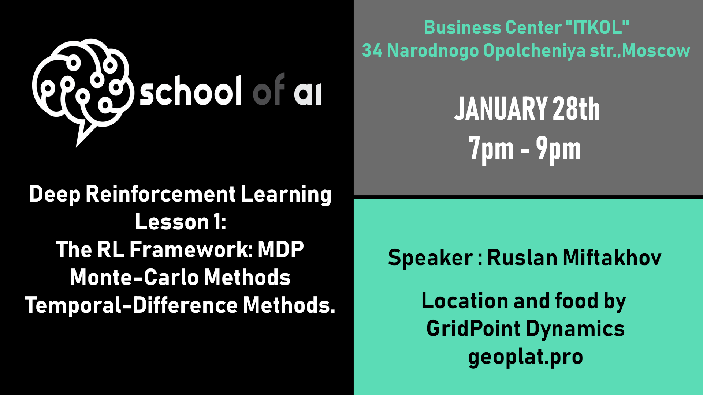
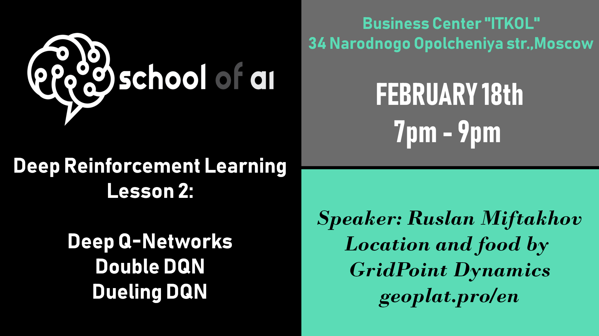

# Deep Reinforcement Learning course at Moscow School of AI

I am pleased to announce the beginning of lectures and practical sessions on the topic of "Reinforcement Learning".

The course of lectures is composed so that you can understand the basics of RL as MDP and Markov Games, train an intelligent agent using the algorithms like DQN, PPO, A3C, MADDPG and ultimately apply the knowledge to solve problems that you choose for yourself.
